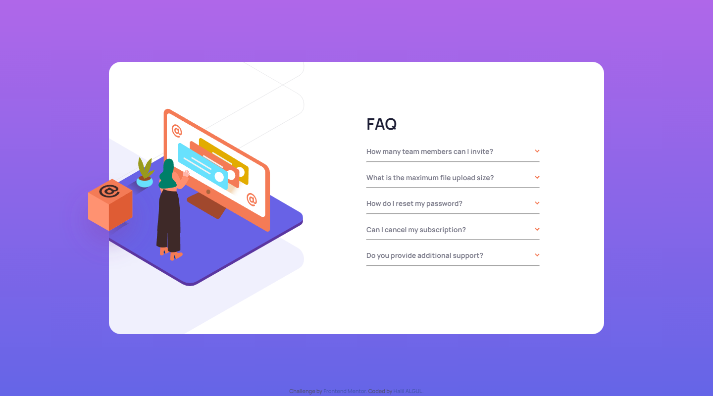

# Frontend Mentor - FAQ Accordion Card Solution

This is a solution to the [FAQ Accordion Card challenge on Frontend Mentor](https://www.frontendmentor.io/challenges/faq-accordion-card-XlyjD0Oam/hub/faq-accordion-card-with-html-css-javascript-SkXfvCaH5). Frontend Mentor challenges help you improve your coding skills by building realistic projects.

## Table of contents

- [Frontend Mentor - FAQ Accordion Card Solution](#frontend-mentor---faq-accordion-card-solution)
  - [Table of contents](#table-of-contents)
  - [Overview](#overview)
    - [The challenge](#the-challenge)
    - [Screenshot](#screenshot)
    - [Links](#links)
    - [Built with](#built-with)
    - [What I learned](#what-i-learned)
    - [Useful resources](#useful-resources)
  - [Author](#author)

## Overview

### The challenge

Users should be able to:

- View the optimal layout for the component depending on their device's screen size
- See hover states for all interactive elements on the page
- Hide/Show the answer to a question when the question is clicked

### Screenshot

- 
- 
- 
- 

### Links

- Solution URL: [Frontend Mentor | My Solution](https://www.frontendmentor.io/solutions/faq-accordion-card-with-html-css-javascript-SkXfvCaH5)
  
- Live Site URL: [Halibal | FAQ Accordion Card](https://halibal.github.io/faq-accordion-card/)

### Built with

- Semantic HTML5 markup
- CSS custom properties
- [Flex](https://getbootstrap.com/docs/5.0/utilities/flex/)
- [JavaScript](https://www.javascript.com)

### What I learned

```css
  .shadow {
    filter: drop-shadow(offset-x offset-y blur-radius color);
  }

  .item {
    width: clamp(<min>px, ...%, <max>px) /* To ensure that the width of the item is ...% of parent, but > ...px(minimum) and < ...px(maximum) */
  }
```

### Useful resources

- [Developer Mozilla | drop-shadow()](https://developer.mozilla.org/en-US/docs/Web/CSS/filter-function/drop-shadow)

## Author

- LinkedIn - [Halil ALGUL](https://www.linkedin.com/in/halilagul/)
- Frontend Mentor - [@halibal](https://www.frontendmentor.io/profile/halibal)
- github - [halibal](https://github.com/halibal)
